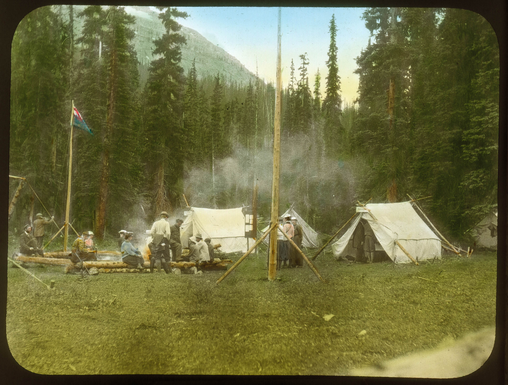
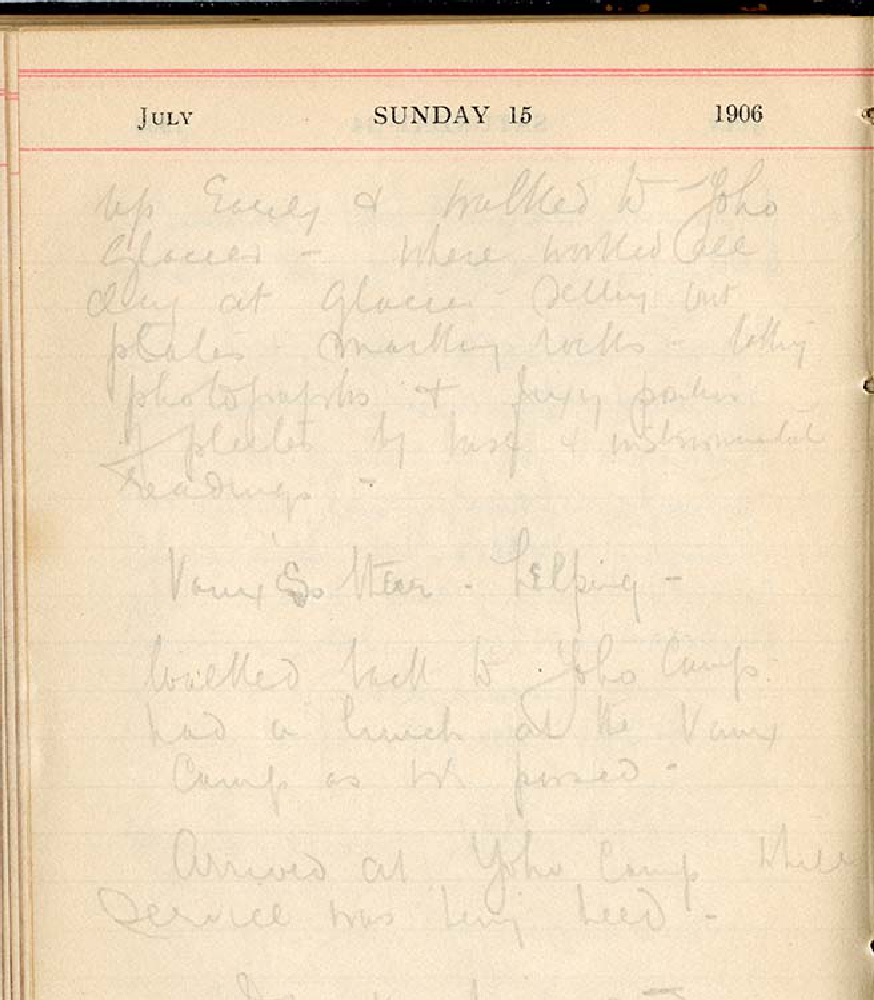
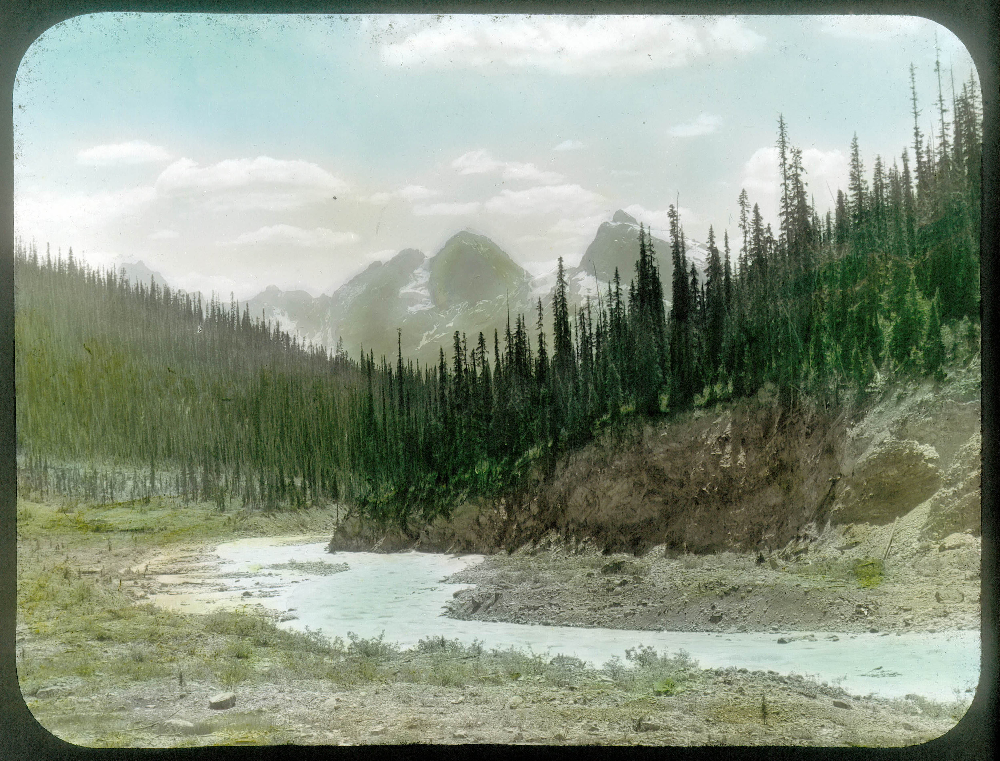
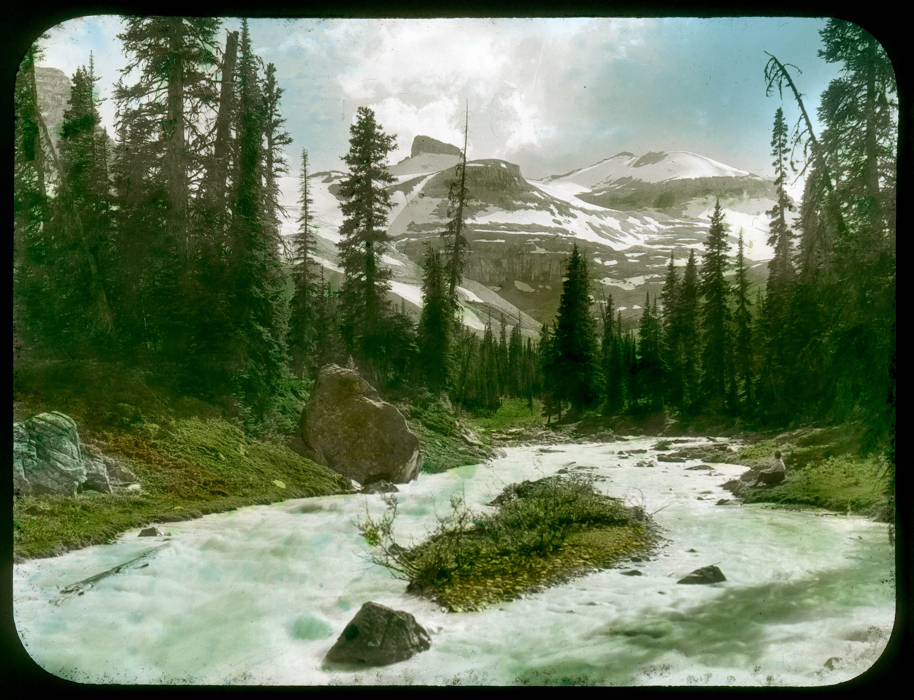
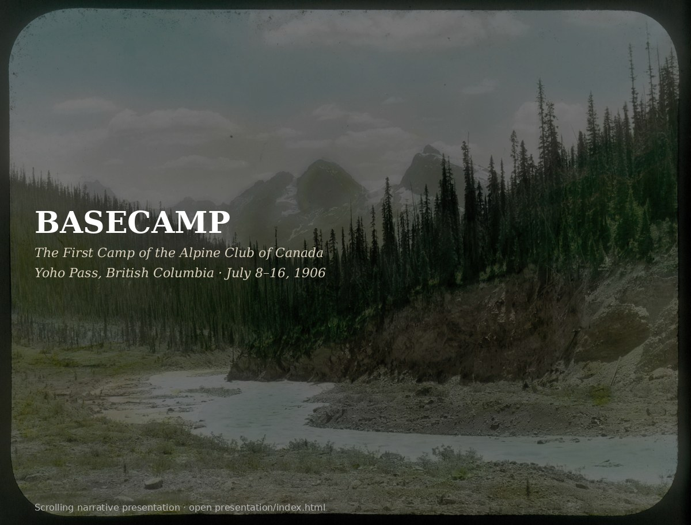

<p align="center">
  
</p>

<p align="center"><em>The first camp of the Alpine Club of Canada. Tents, flagpole, and climbers gathered on log benches at Summit Lake (Yoho Pass), July 1906.<br>Vaux family lantern slide PS-110 · <a href="https://archives.whyte.org/en/permalink/descriptions34207">Whyte Museum V653</a></em></p>

# BASECAMP

**Reconstructing the inaugural Alpine Club of Canada camp at Yoho Pass, British Columbia — July 8–16, 1906.**

A primary-source research corpus and presentation marking the **ACC 120th anniversary**. Every image, quote, and date in this project traces back to a public museum or archive record. No Wikipedia. No blogs. No secondary sources without provenance.

---

## The Story

On the morning of July 9, 1906, a thin line of amateur mountaineers crossed the bridge over the Kicking Horse River at Field, British Columbia, and walked into the forest toward Yoho Pass. They were headed for the first organized alpine camp in Canadian history — a cluster of canvas tents at Summit Lake, directed by surveyor Arthur Oliver Wheeler and staffed by Swiss guides Edward and Christian Feuz.

For nine days they climbed peaks, explored glaciers, auctioned ice axes around the campfire, and — on a single pivotal Sunday — conducted a scientific glacier survey that would produce data still referenced 120 years later.

This project reconstructs those nine days from the paper trail they left behind.

---

## The Cross-Source Proof

The most significant finding is a measurement that appears in two independent primary sources, written by two different people, in two different countries, and published in two different journals — yet the numbers match to within nine inches.

<p align="center">
  
</p>

<p align="center"><em>Wheeler's pocket daytimer, July 15, 1906. Pencil cursive on printed day-page.<br><a href="https://archives.whyte.org/en/permalink/descriptions23111">Whyte Museum M546/13</a></em></p>

**Source 1 — Wheeler's daytimer (Whyte Museum, Banff):**
Wheeler records working all day at the glacier with the Vaux brothers — setting out plates, marking rocks, photographing, taking instrumental readings. His measurement: **76 feet 7 inches** from the 1901 bedrock mark to the glacier ice.

**Source 2 — Vaux brothers' paper (Academy of Natural Sciences, Philadelphia):**
George and William S. Vaux published their 1907 glacier observations in the *Proceedings of the Academy of Natural Sciences of Philadelphia*. For the Yoho Glacier they report: distance from the bedrock marked August 17, 1901 to the ice = **147 feet 4 inches** in 1907, with a recession of **70 feet** for the year. Back-calculate to 1906: 147'4" − 70' = **77'4"**.

Two field parties. Two tape measurements along a crevassed glacier snout. A nine-inch delta. The first ACC camp was not only a climbing holiday — for three days of its second week it was a working glaciological field station.

<p align="center">
  
</p>

<p align="center"><em>"Looking back from Fort, Wapta Glacier, Yoho Valley, Field B.C. 1906" — the view from the bedrock survey station where the measurement was taken.<br>Vaux family lantern slide PS-095 · <a href="https://archives.whyte.org/en/permalink/descriptions34193">Whyte Museum V653</a></em></p>

---

## The Vaux 1906 Shot List

We scraped the full Vaux family fonds (V653) from the Whyte Museum's AtoM archive — **3,051 records** — and filtered to **275 items dated 1906**. Of those, 215 are Canadian Rockies subjects. The 1906 field plates carry sequential "(No.NN)" numbers that reveal the Vaux family's complete photographic itinerary:

| Plate Nos. | Subject | Assigned Date | Source |
|:--|:--|:--|:--|
| No. 1–3 | Camp at Summit Lake | Jul 8–16 (camp window) | Content match |
| No. 4–13 | Upper Yoho Valley panoramas | Jul 14–15 | Content match |
| No. 14–29 | **Wapta/Yoho Glacier survey** | **Jul 15** | Wheeler daytimer confirms |
| No. 30–39 | Laughing Falls | Jul 14 | Wheeler: "camped at Laughing Falls" |
| No. 40–44 | Takakkaw Falls | Jul 17 | Trip #2 dated "7/17/06" |
| No. 52–62 | Selkirks (Illecillewaet, Asulkan) | Trip #9 | Content match |
| No. 63–76 | Paradise Valley | Sep 28 | Trip #3 dated "9/28/06" |
| No. 79–100 | Ptarmigan / Pipestone Pass | Jul 2–4 | Pre-camp trips #4, #5 |
| No. 101–102 | Lake Louise Chalet | Jul 6 | Trip #6 dated "7/6/06" |

Fifteen plates — No. 14 through 29 — are the glacier survey record from July 15, 1906. These include test pictures, ice arch studies, a three-panel panorama, and forefoot measurements. The Vaux brothers were not casual tourists with cameras. They were running a systematic glacier-monitoring program that had begun at the Illecillewaet in 1887 and would continue until 1913.

<p align="center">
  
</p>

<p align="center"><em>Emerald Group from Wapta, Yoho 1906. Hand-tinted lantern slide PS-098.<br><a href="https://archives.whyte.org/en/permalink/descriptions34196">Whyte Museum V653</a></em></p>

---

## Research Artifacts

All research outputs are in the repo and machine-readable:

**`people/george-vaux/research/1906_shotlist/`**

| File | Description |
|:--|:--|
| `vaux_1906_contact_sheet.pdf` | 7-page visual contact sheet — 244 Rockies 1906 images with ref codes and titles |
| `daytimer_vaux_matched.pdf` | 11-page side-by-side: Wheeler daytimer facsimile paired with matched Vaux plates, one page per day Jul 7–17 |
| `vaux_1906_plate_day_mapping.csv` | 94 numbered plates with assigned dates and reasoning |
| `vaux_1906_flagged.csv` | 67 records matching Fort / cairn / camp / station / Summit Lake / Wapta / Yoho Glacier |
| `vaux_1906_rockies.csv` | 260 Canadian Rockies 1906 records |
| `vaux_1906_all.csv` | All 275 1906-dated V653 records |

**`people/arthur-wheeler/daytimer_pages/`**

| File | Description |
|:--|:--|
| `1906_jul07_sat.png` – `1906_jul17_tue.png` | 11 facsimile page images from Wheeler's pocket daytimer, 350 DPI |
| `TRANSCRIPTION_1906_camp_window.md` | Full transcription of the July 7–17 camp window with keywords and cross-references |

---

## The Nine Days

From Wheeler's daytimer, transcribed page by page:

| Date | Key Events |
|:--|:--|
| **Sat Jul 7** | Wheeler rides to Field. Supplies arrive. Swiss guide Walter Fynn and additional guides assemble. |
| **Sun Jul 8 ★** | **Camp opens.** First climb of Mt. Burgess — a trail-scouting mission by Feuz, Feuz, and Herdman. |
| **Mon Jul 9** | 4 a.m. start. Wheeler gives his ponies to visitors. Camp fully populated by nightfall. |
| **Tue Jul 10** | Official climbs begin: Mt. Stephen, Mt. President. Herdman takes party to Emerald Glacier. Thunder. |
| **Wed Jul 11** | First Yoho Valley party. Mt. Wapta climb. Fine weather. "Every one happy and pleased." |
| **Thu Jul 12** | Mt. Wapta again. Herdman → Mt. Field. Heelis → Lookout Point. Big campfire. |
| **Fri Jul 13** | A.P. Coleman auctions ice axes — raises over $75. Mrs. Bridgland climbs Mt. Wapta. |
| **Sat Jul 14** | **Last official climb.** Packing section sent to mark glacier. Wheeler camps at Laughing Falls. |
| **Sun Jul 15 ★** | **Glacier survey day.** Wheeler + Vaux brothers at Yoho Glacier — setting plates, marking rocks, photographing. |
| **Mon Jul 16** | **Camp closes.** Tents coming down. Late Mt. Marpole party returns "drenched but joyful." |
| **Tue Jul 17** | Full dismantling. Only Elizabeth Parker and her party remain — the last to leave. |

---

## People

22 person profiles with archival artifacts, sourced from the Whyte Museum, Library and Archives Canada, and the Canadian Alpine Journal Vol. 1 No. 1 (1907):

Arthur Oliver Wheeler (director) · Elizabeth Parker (co-founder, last to leave) · Jean Parker (daughter, later ACC Librarian) · George Vaux Jr. (glaciologist) · William S. Vaux (glaciologist) · Mary Vaux (glaciologist, photographer) · Edward Feuz Sr. (Swiss guide) · Gottfried Feuz (guide) · E.O. Wheeler (surveyor) · Herschel Wheeler · J.C. Herdman · Morrison Bridgland · Byron Harmon (photographer) · Frank Yeigh (journalist) · Julia Henshaw (botanist) · Ralph Connor (novelist) · George Kinney · F.W. Freeborn · E.C. Barnes · J.D. Patterson · P.D. McTavish · R.E. Campbell (outfitter)

---

## Key Sources

| Source | Archive | What it provides |
|:--|:--|:--|
| Wheeler daytimer 1906 | [Whyte Museum M546/13](https://archives.whyte.org/en/permalink/descriptions23111) | Day-by-day camp operations in Wheeler's pencil cursive |
| Vaux family fonds V653 | [Whyte Museum V653](https://archives.whyte.org/en/permalink/descriptions391) | 3,051 photographs, negatives, and lantern slides (275 dated 1906) |
| Vaux 1907 glacier paper | ANSP Proceedings, Dec 1907 | Glacier recession measurements, plate-flow data |
| Canadian Alpine Journal Vol.1 No.1 | ACC Archives, 1907 | 31 articles covering the 1906 camp, climbs, and founding |
| Alexander Lambie fonds V345 | [Whyte Museum V345](https://archives.whyte.org/en/permalink/descriptions498) | 52 prints from 1906 Yoho camp (physical only, not digitized) |

---

## Presentation

<p align="center">
  
</p>

<p align="center"><em>Open <code>presentation/index.html</code> in a browser for the scrolling cinematic narrative.</em></p>

---

## Repo Structure

```
articles/              35 CAJ Vol.1 No.1 article transcriptions
intelligence/          Structured databases: people, places, camps, routes (JSON)
maps/                  GeoJSON, KML, and interactive map data
people/                22 person profiles with Whyte Museum artifacts
presentation/          Scrolling cinematic narrative (index.html)
silos/                 18 article-based research silos
source/                CAJ Vol.1 No.1 source material (epub)
tools/                 Python build scripts
```
