# HermesPresentation

## The Mountain That Invented a Club

This should not stay a slide deck.

The deck is a proof of tone: fire, ice, railway spectacle, women on the rope, Vaux cameras, bad weather, bad pins, and a glacier quietly turning into a clock. The bigger thing should feel like a field transmission from a mountain archive.

Open the current local version:

```bash
cd /mnt/c/Users/chris/BASECAMP/presentation/HermesPresentation
./run.sh
```

Then visit:

http://127.0.0.1:8765/index.html

Controls: left/right arrows, Home/End, `M` for map lens, `E` for evidence overlay.

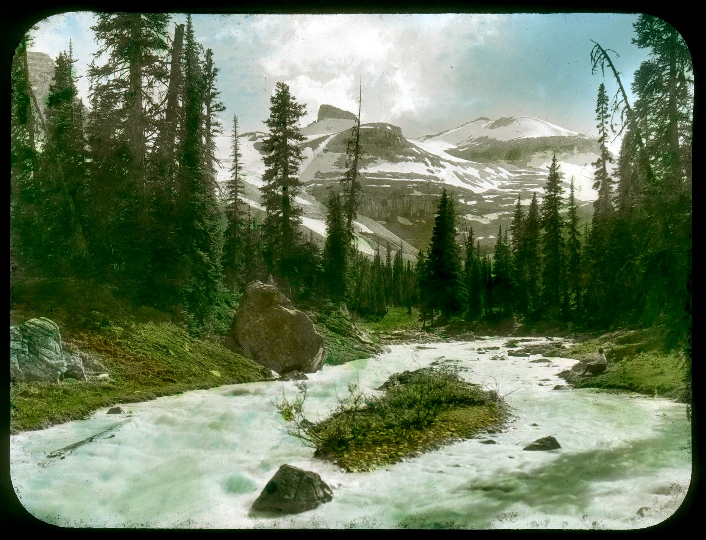

---

## What this wants to become

### 1. A living field atlas

Not a presentation. A place you enter.

The first screen is a modern Yoho map, but every location has an uncertainty halo. You do not click a pin. You click a probability. Each place opens a drawer: historic photo, modern satellite view, source quote, confidence level, related people, and what we should not overclaim.

The rule:

> no exact pins unless the archive earns them.

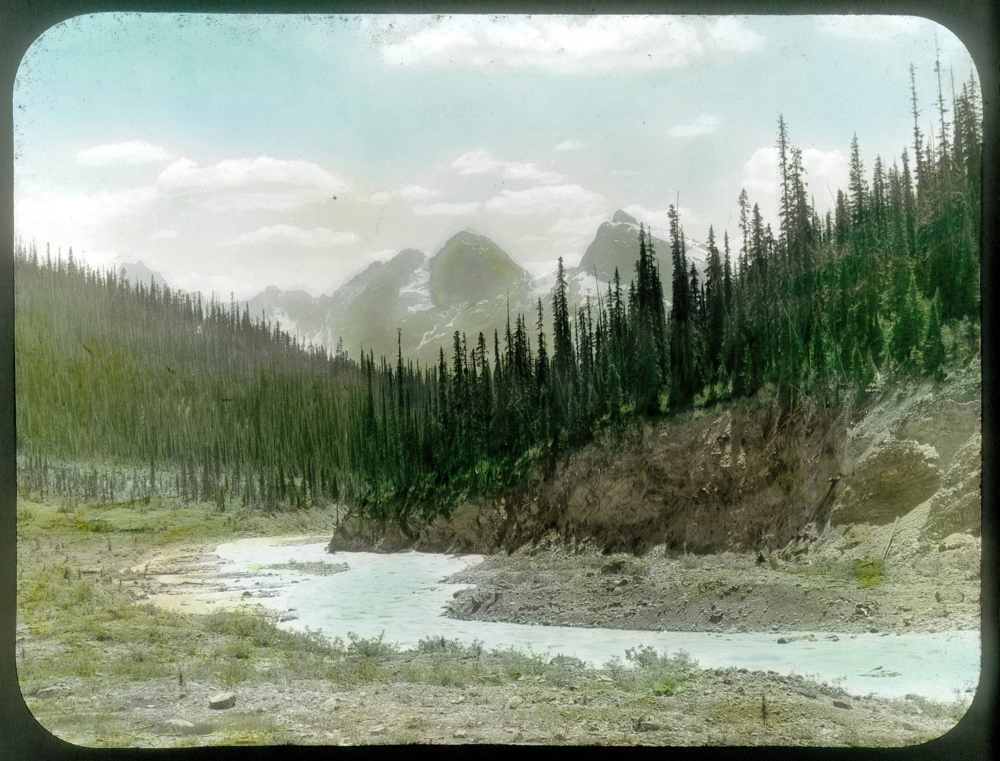

### 2. A Google Earth ghost route

Build a flyover from Field to Emerald Lake, Yoho Pass, Yoho Camp, Takakkaw, and the glacier zone. But make the uncertainty visible: the camera flies through translucent corridors, not clean GPS tracks.

The route should have chapters:

- railway fever at Field
- the Emerald delta and the broken bridges
- Yoho Pass as ordeal
- the canvas town
- the Vice-President as citizenship exam
- July 15, the glacier clock
- closing day, when the archive starts lying to itself

### 3. A light table for the Vaux contact sheets

The contact sheets are the soul of this thing. They should become their own interface: a darkroom wall where you zoom, compare, reorder, and see the mountain as method.

Not one heroic image. Sequence. Repetition. Return.

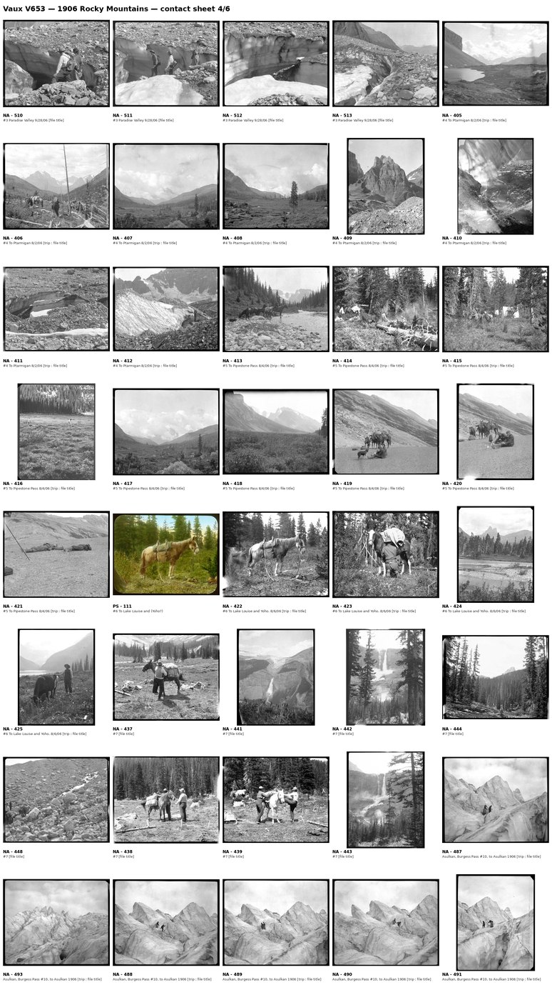

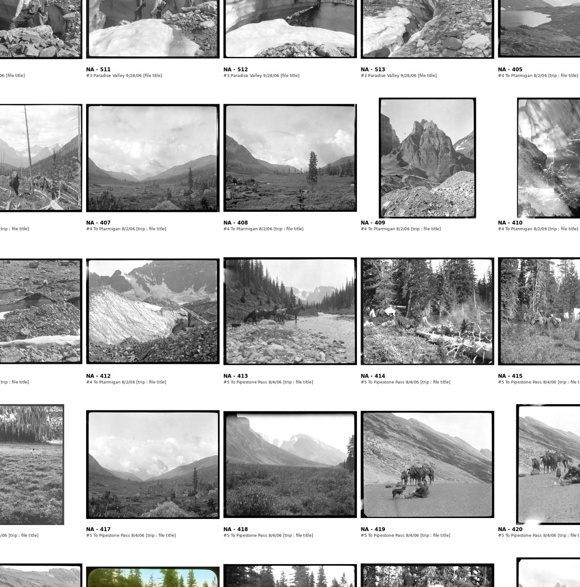

### 4. A documentary essay, not a talk

This could be a 12-18 minute narrated film:

- cold open: black screen, rain, pack animals, railway whistle
- Field Station fever
- the deluge at Emerald
- a tent city appears in the trees
- women are told: no skirts on the rope
- Parker attacks Mammon while using the railway Mammon built
- Vaux brothers and Wheeler turn a glacier into a measuring instrument
- the archive contradicts itself on the way out
- cut to modern Yoho: same places, changed ice, uncertain pins

The line I would build the film around:

> You cannot visit 1906. You can visit the places that hold its shadow.

### 5. A museum exhibit in the browser

Make the site feel like walking through rooms:

1. Arrival room: trains, packs, comic equipment, umbrellas.
2. Water room: delta, deluge, washed out bridges.
3. Canvas room: the temporary town.
4. Rope room: women, clothing rules, guides, danger.
5. Fire room: songs, speeches, camp ritual.
6. Ice room: Vaux, Wheeler, glacier measurement.
7. Map room: modern Yoho with uncertainty halos.
8. Absence room: the final contact sheet, almost empty.

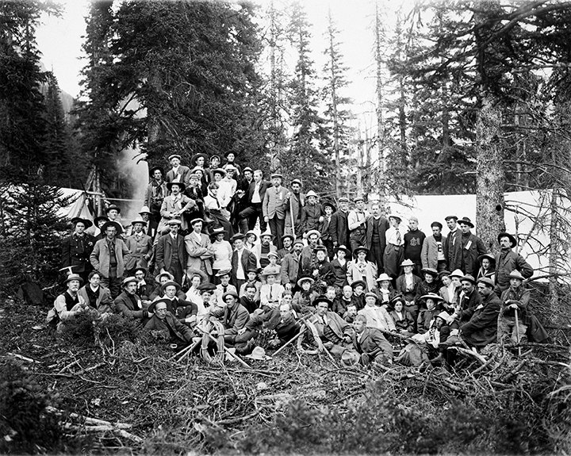

### 6. A printed zine / artifact packet

The physical version might be more powerful than slides:

- fold-out route map with uncertainty halos
- eight artifact cards
- one Vaux contact sheet poster
- one page of Wheeler diary facsimile
- one Parker anti-Mammon broadside
- one “No skirts on the rope” rule card
- one glacier measurement card: 76 ft 7 in

The object should feel like something found in a ranger station drawer.

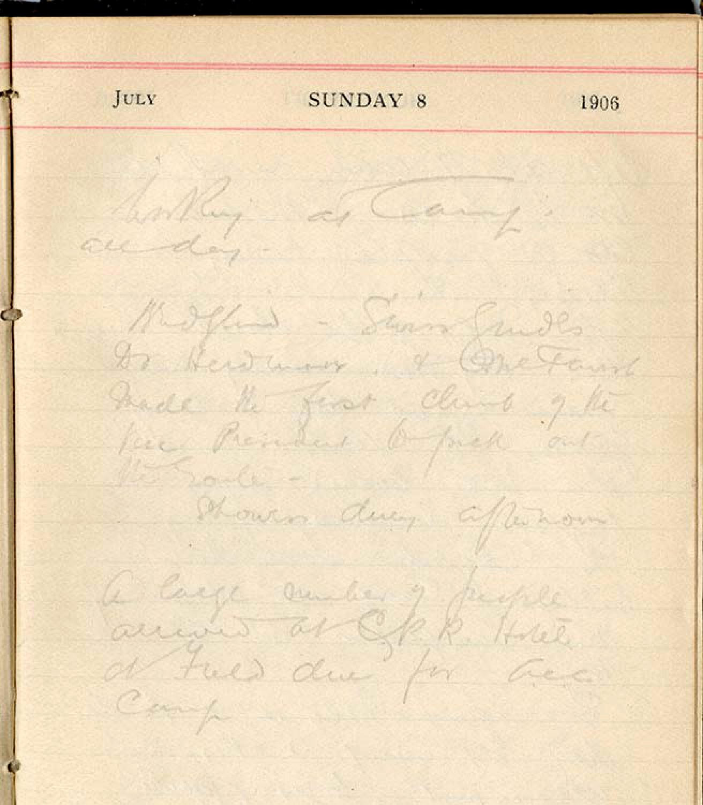

### 7. An audio walk

A visitor stands in modern Yoho and listens.

Each stop is 2-3 minutes. The narration refuses false certainty. It says: this may be the place, or near the place, or the kind of place. Then it gives the listener the scene.

Good stops:

- Field station
- Emerald Lake north shore / delta
- Yoho Pass
- Yoho Lake
- Takakkaw Falls
- Yoho Camp probability zone
- Yoho Glacier / Wapta forefoot

### 8. A source-first archive game

Make users solve the story.

Give them conflicting cards: Wheeler diary, official report, Vaux paper, contact sheet, place estimate, route description. They drag evidence onto a map and decide what can be claimed.

The point is not to win. The point is to feel how history is built.

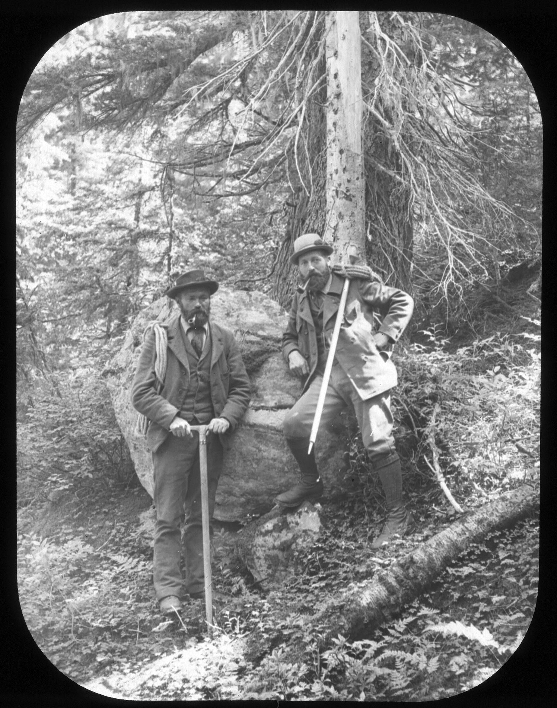

---

## The story spine

### Act I: Fever

A new club gathers at Field with too much gear and not enough certainty. The railway has made wilderness accessible, and everyone is pretending that this does not change the wilderness.

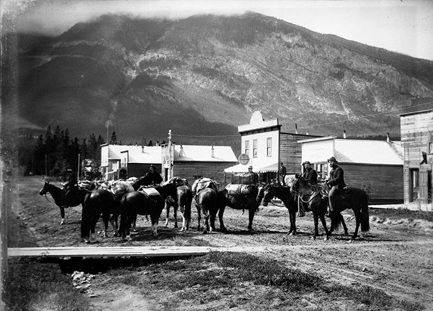

### Act II: Water

The map fails at Emerald. Bridges are gone. Pack ponies become bridges. The picturesque route becomes wet, comic, and dangerous.

### Act III: Canvas

A town appears at 6,000 feet. Residence Park. Official Square. Dining tent. Campfire. Bulletin board. A civic institution rehearsed in canvas.

### Act IV: Rope

The club invents membership through ordeal. The Vice-President is not only a mountain. It is an exam. The gender story is not ornamental: the women on the rope prove the institution's claim about who belongs in the mountains.

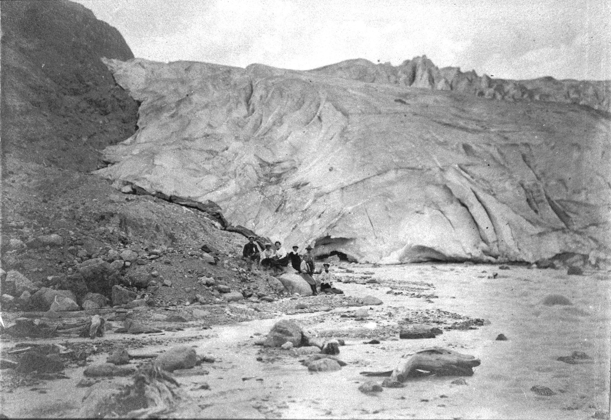

### Act V: Mammon

Elizabeth Parker sees the trap immediately. The railway opens the mountain; hotels and spectacle may ruin it. The club is born inside the contradiction it will spend its life managing.

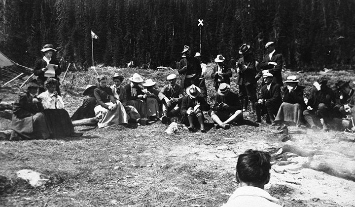

### Act VI: Ice

July 15, 1906. Wheeler's diary and the Vaux glacier paper meet on the same day. “Vaux Bros. there helping.” “76 feet 7 inches.” The camp becomes a field station. The glacier becomes a clock.

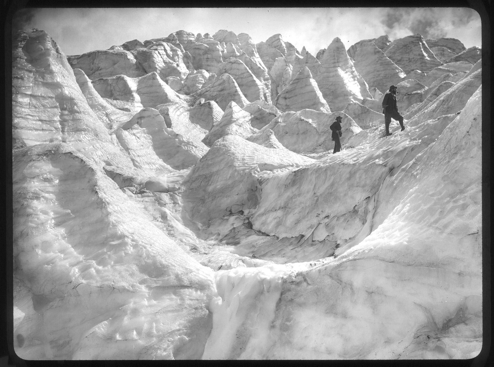

### Act VII: Contradiction

The closing story will not stay clean. One source says one thing, another says another. Keep that. The archive is not a verdict. It is weather.

### Act VIII: Return

The modern visitor cannot recover the exact bootprint. They can return to the place, the corridor, the changed ice, the uncertainty, and the argument.


---

## Build next

If we keep going, I would build these in this order:

1. `LightTable/` — built now: a Vaux contact-sheet explorer with loupe, sequence mode, source metadata, map guesses, and absence mode.
2. `EarthFlyover/` — a local HTML route film with map corridors, not pins.
3. `FieldAtlas/` — a non-linear browser exhibit: rooms, drawers, evidence cards.
4. `Zine/` — printable PDF artifact packet.
5. `AudioWalk/` — scripts and generated audio for modern Yoho stops.

Open the LightTable prototype from the running parent server:

http://127.0.0.1:8765/LightTable/index.html

Or run it standalone:

```bash
cd /mnt/c/Users/chris/BASECAMP/presentation/HermesPresentation/LightTable
./run.sh
```

The presentation is only the trailer.

The real project is an archive you can walk through.
